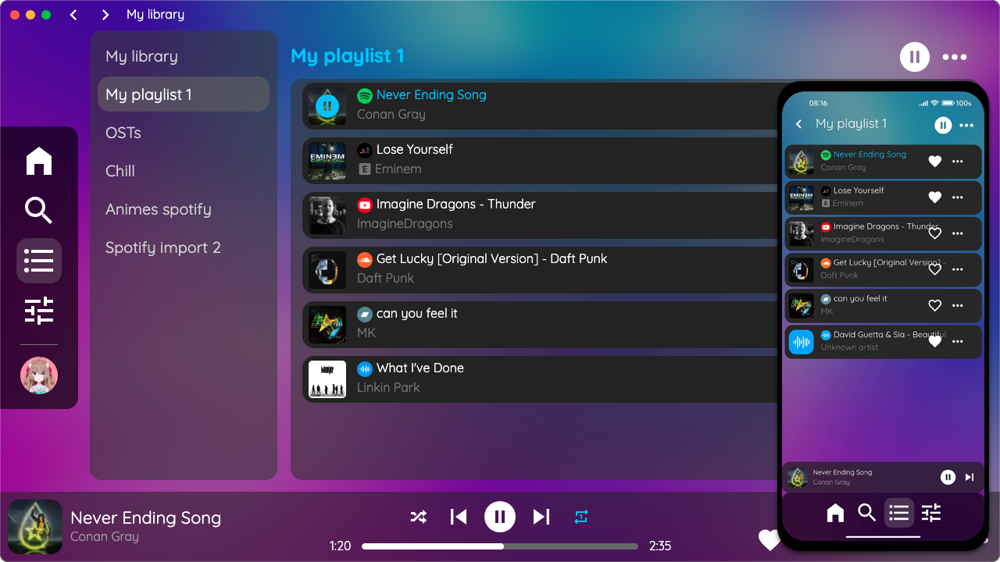

# AyMusic-Electron

AyMusic allows you to create playlists with music on **Spotify, Youtube, Deezer, Soundcloud, Bandcamp and locally from your computer**. You can use this application if you want to create a playlist of music on Spotify but there's some music that you can't find on Spotify but on another platform.

With AyMusic you can do this without any problems. Create a playlist, add your music to one platform and then add it to other platforms and AyMusic will play your favourite music!

This repository is the Electron application for AyMusic.

## How to install the app
1. Install node
2. `npm install`
3. `git restore .`: **important, will make musics working**
4. Clone sub-modules

## How to use the app (development mode)
1. In `res/main.js`, modify the line `94` to `if (true)` to use our public production server
2. `npm start`
3. If the app doesn't launch with `npm start`:
    - On Linux with Visual Studio Code (or other Electron-based IDEs): launch the app with `npm run start:vsc`
    - On macOS: launch the app with `npm run start:mac`

### Use Spotify (for Windows and macOS)
1. Install Python 
2. Install castlabs's EVS: `python3 -m pip install --upgrade castlabs-evs` (necessary to use Spotify)
3. Connect to your EVS account: `python3 -m castlabs_evs.account reauth` or `python3 -m castlabs_evs.account signup`
4. Sign the app:
    - On Windows: `python -m castlabs_evs.vmp sign-pkg .\node_modules\electron\dist\`
    - On macOS: `python3 -m castlabs_evs.vmp sign-pkg ./node_modules/electron/dist`

### Use Discord RPC (for Windows)
1. Create file named `.env` in the root folder
2. Put `DISCORD_CLIENT_ID=...` in this file and replace `...` by your Discord Client ID

## How to do a release build for Windows
1. Install Python 
2. Create file named `.env` in the root folder
3. Install castlabs's EVS: `python3 -m pip install --upgrade castlabs-evs` (necessary to use Spotify)
4. Connect to your EVS account: `python3 -m castlabs_evs.account reauth` or `python3 -m castlabs_evs.account signup`
5. Replace `process.env.DISCORD_CLIENT_ID` by your Discord Client ID if you want Discord integration (optional)
6. `npm run build:win`

## How to do a release build for macOS
1. Install Python 
2. Create file named `.env` in the root folder
3. Install castlabs's EVS: `python3 -m pip install --upgrade castlabs-evs` (necessary to use Spotify)
4. Connect to your EVS account: `python3 -m castlabs_evs.account reauth` or `python3 -m castlabs_evs.account signup`
5. `npm run build:mac`

## How to do a release build for Linux
1. Install Python
2. Install `libarchive-tools`, like: `sudo apt install libarchive-tools` (Debian)
2. Create file named `.env` in the root folder
3. `npm run build:linux`

## Repos used
- [AyMusic's WebAssets](https://github.com/Shiyukine/AyMusic-WebAssets)
- [AketsukyUpdater for Windows](https://github.com/Shiyukine/AketsukyUpdater)
- [Fork of discordJS/RPC](https://github.com/Shiyukine/discordjs-RPC)
- [castlabs/electron-releases](https://github.com/castlabs/electron-releases)

## Other repos
- [Android application of AyMusic](https://github.com/Shiyukine/AyMusic-Android)
- [iOS application of AyMusic](https://github.com/Shiyukine/AyMusic-iOS)